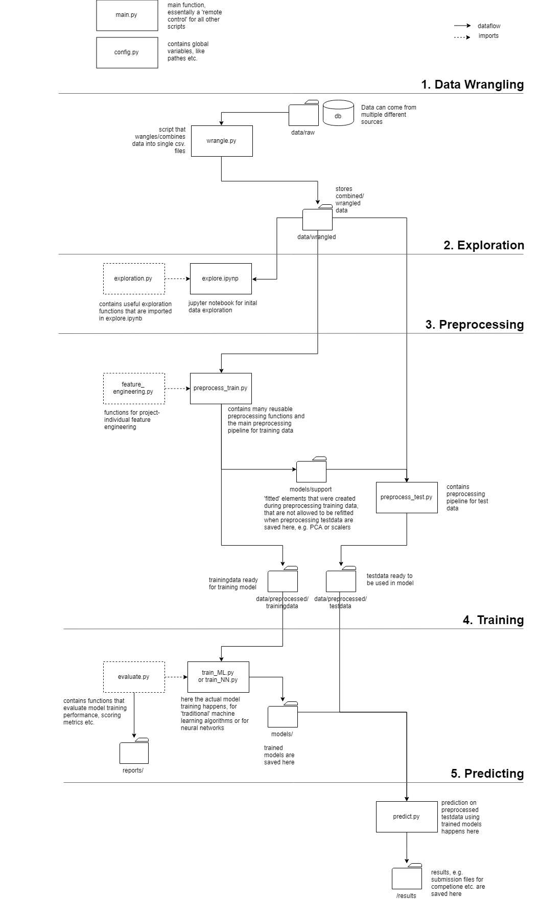

# Machine Learning Essentials  
"Machine Learning Essentials" is two things at the same time:
1. A workflow structure for doing machine learning (in this case: building and
evaluating a model)
2. A collection of frequently used functions.
The goal of this project is to provide a solid template that
can - after customization - be used for many of the "classical"
classification and/or regression problems that might occur in a hands-on
business context. No fancy rocket science, but solid machine learning
with a practial approach. 
It is continuoulsy developed - so if I come across new and exiting 
things that fit in, I will definitely add them.
## Used Tech
#### General
Python 3.6 
#### Data Handling
numpy 
pandas 
scipy 
#### Models 
Keras 
tensorflow 
scikit-learn 
xgboost 
#### Plotting
matplotlib 
seaborn 
## Main Process
#### 1. Data Wrangling
#### 2. Exploration
#### 3. Preprocessing
#### 4. Training
#### 5. Predicting
## Workflow Structure

## Files
main.py 
config.py 
wrangle.py 
exploration.py 
explore.ipynb 
preprocess_train.py 
feature_engineering.py 
train_ML.py 
train_NN.py 
evaluate.py 
preprocess_test.py 
predict.py 
## Folder Structure
-/data - *contains all data* 
-/data/raw - *contains raw data, raw files, in various formats, shapes etc.* 
-/data/wrangled - *train.csv, test.csv combining wrangled features in single files* 
-/data/preprocessed - *numerical, cleaned data for direct use in ML models* 
-/models - *contains trained models* 
-/models/support - *support models like fitted PCAs, scalers etc that will be applied on test data* 
-/results - *all results* 
-/reports - *model information, trainings scores, neural net learning history etc.* 